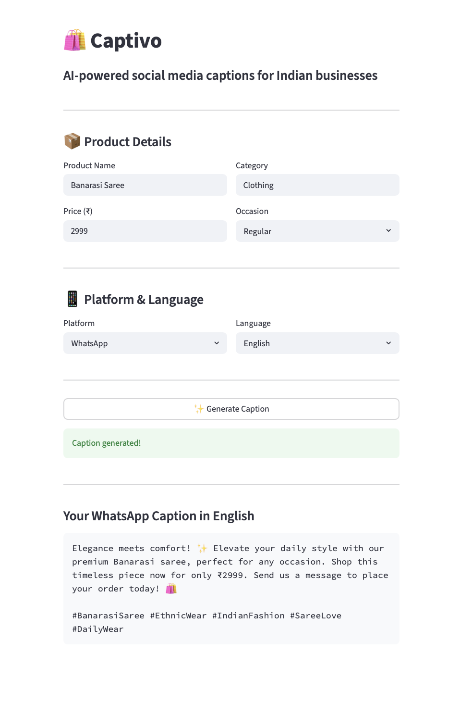
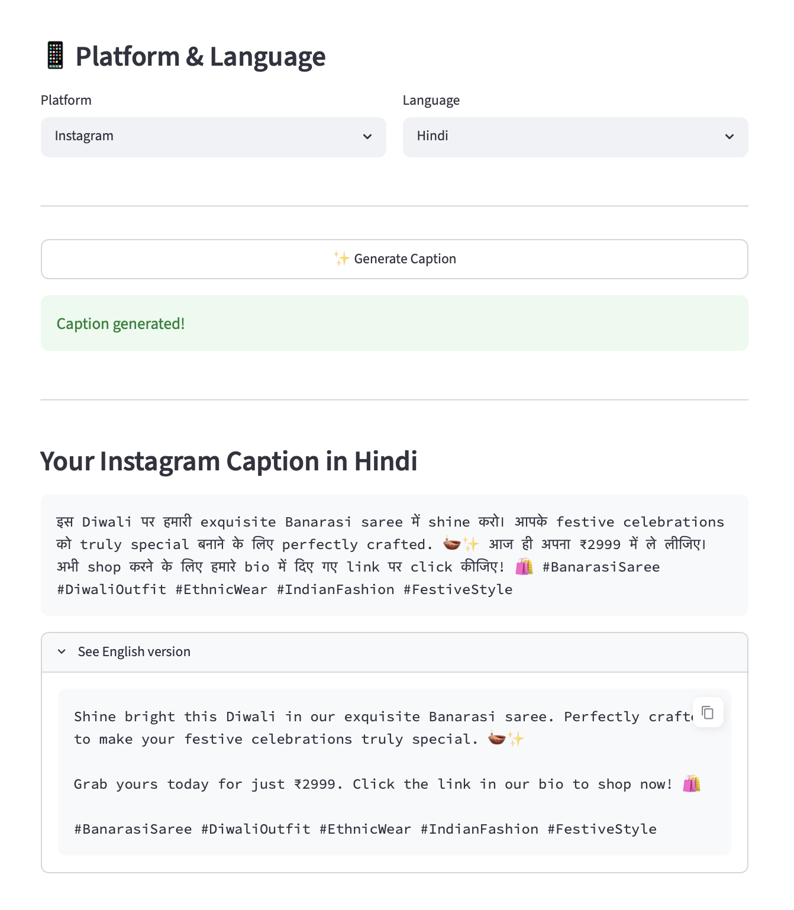
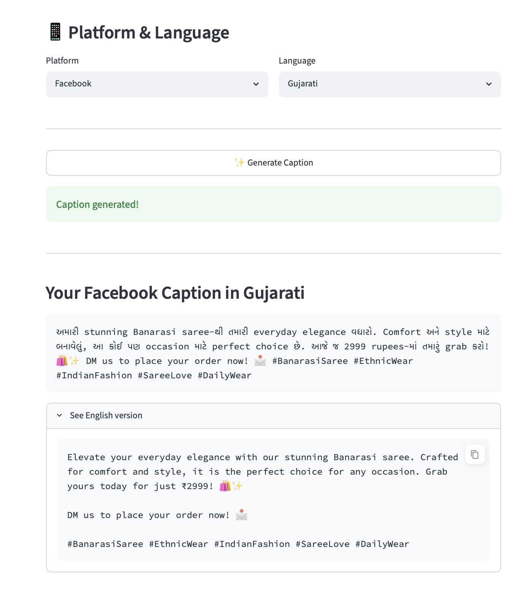

# 🛍️ Captivo
### AI-powered social media captions for Indian businesses

[](https://huggingface.co/spaces/Farhinv/Captivo)
[](https://github.com/farhin-v/captivo)

---

## What is Captivo?

Captivo helps Indian small business owners generate ready-to-post social media captions in seconds — in their own language.

A saree shop owner in Surat shouldn't need to know English to post on Instagram. Captivo takes your product details and generates professional captions in 10+ Indian languages, tailored for Indian festivals and occasions.

---

## The Problem

Indian SMB owners know their products deeply but struggle to write captions in English. They either skip posting entirely or depend on a younger family member to write for them. This means lost customers and missed sales every day.

---

## The Solution

Enter your product name, price, category and occasion. Captivo generates a professional, platform-specific caption with emojis and hashtags — in your language, in seconds.

---

## Screenshots

### Home Screen


### English Caption Generated


### Hindi Caption


### Gujarati Caption


---

## Features

- **10+ Indian Languages** — Hindi, Gujarati, Tamil, Telugu, Marathi, Bengali, Kannada, Malayalam, Punjabi, Urdu
- **3 Platforms** — Instagram, Facebook, WhatsApp
- **Festival Aware** — Diwali, Eid, Navratri, Holi, Christmas and more
- **Side by Side Layout** — Input on left, output on right, no scrolling
- **One Click Copy** — Copy caption directly from the output box

---

## Tech Stack

| Layer | Technology | Purpose |
|-------|-----------|---------|
| UI | Streamlit | Web interface |
| Caption Generation | Google Gemini Flash | English caption generation |
| Translation | Sarvam AI | Indian language translation |
| Deployment | HuggingFace Spaces | Live public URL |
| Version Control | GitHub | Code management |

---

## Architecture
User Input (Product Name, Price, Category, Platform, Language, Occasion)

↓

Gemini Flash generates English caption with platform-specific tone

↓

If Indian language selected → Sarvam AI translates using modern-colloquial mode

↓

Caption displayed with one-click copy

---

## Why Sarvam AI?

Unlike generic translation APIs, Sarvam AI is built specifically for Indian languages and understands how Indians actually write on social media — naturally mixing English and regional language words the way real users do.

---

## Product Decisions

**Why generate English first then translate?**
Gemini produces higher quality, more creative captions in English. Sarvam then translates them naturally rather than literally, giving better results than generating directly in regional languages.

**Why stratified sampling for large catalogs?**
To ensure all product categories are represented in search results regardless of how the CSV is sorted.

**Why modern-colloquial translation mode?**
Social media content needs to sound natural and casual. Modern-colloquial mode produces text that matches how Indians actually write on Instagram and WhatsApp.

---

## Local Setup

```bash
# Clone the repository
git clone https://github.com/farhin-v/captivo.git
cd captivo

# Create virtual environment
python3 -m venv venv
source venv/bin/activate

# Install dependencies
pip install -r requirements.txt

# Add your API keys
cp .env.example .env
# Edit .env with your GOOGLE_API_KEY and SARVAM_API_KEY

# Run the app
streamlit run app.py
```

---

## Built By

Farhin Vasaya — AI Engineer with a background in product management and an MS in Computer Science (AI/ML) from Texas A&M. Passionate about building AI systems that solve real problems for real users.

[LinkedIn](https://linkedin.com/in/farhin-vasaya) · [GitHub](https://github.com/farhin-v)